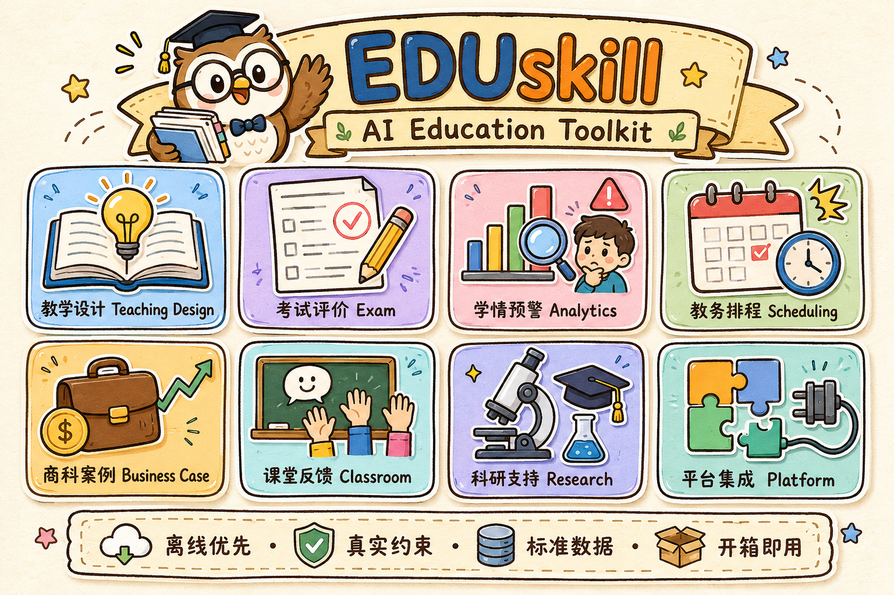

# EDUskill

> 一个正在生长的 AI 教育工具包集合，由一个人在碎片时间里每天做一点。

---

## 为什么做这些

我在思考一件事：**AI 真的能帮教育工作者减轻负担吗？**

教务秘书要手动排课、查冲突、核学分、组织实习分配；老师要设计教学目标、出卷、批改、做讲评——这些工作繁琐、重复、耗时，却很少有工具真正做到"开箱即用"。

于是我开始尝试：**把我每天的工作做成一个个教育领域的Skill**，从真实的教学场景出发，能跑起来、有输出、可以实际用，而不是停留在 Demo 层面。

这个仓库就是这些尝试的归档。

---

## 重要说明

**这些工具目前处于早期阶段，不保证稳定性。**

- 有些场景覆盖不全，边界情况可能报错
- 有些输出格式还在迭代
- 有些逻辑经过自测，但未经过真实教学环境的大量验证

**非常欢迎你来试用、反馈、提建议。** 哪怕只是"这个功能没用"或者"我想要 XX 功能"，都很有价值。

---

## 整体架构



```
EDUskill
│
├── 教学设计与准备（Teaching Design & Prep）
│   ├── structured-teaching-plan-generator   结构化教学方案生成
│   ├── teaching-progress-planner            逐周教学进度日历编制
│   ├── edu-objective-assessment-checker     教学目标-评估一致性诊断
│   ├── classroom-activity-designer          课堂互动活动设计包
│   ├── course-prep-readiness-auditor        备课就绪闭环审计
│   ├── course-material-accessibility-auditor 课程材料无障碍与可读性审核
│   └── talent-training-auditor              人才培养方案合规审核
│
├── 课堂与督导反馈（Classroom & Observation）
│   ├── classroom-interaction-diagnostic     课堂参与度证据化诊断
│   ├── lesson-observation-feedback          督导听课记录转行动建议
│   └── space-learning-mentor                Three.js 3D 空间学习导师
│
├── 考试与评价闭环（Exam & Assessment）
│   ├── exam-blueprint-generator             考试双向细目表
│   ├── exam-paper-assembler                 自动组卷与试卷预览
│   ├── exam-invigilator-planner             考场编排与监考日程
│   ├── exam-score-analyzer                  考后成绩与区分度诊断
│   ├── exam-review-planner                  讲评课备课规划与题卡
│   ├── exam-followup-reviewer               命题质量四象限复盘与回流
│   ├── assessment-moderation-auditor        成绩提交前审核与总评核验
│   └── exit-ticket-analyzer                 课后小测分层分析与补救分组
│
├── 学情、预警与支持（Student Analytics & Support）
│   ├── student-academic-warning             学业风险多维分级预警
│   ├── student-support-triage               学生咨询主题分流与答复
│   ├── attendance-followup-planner          缺勤跟进队列与沟通计划
│   ├── credit-progress-checker              培养方案学分毕业预检
│   ├── homework-grading-analyzer            作业批量批改与学情诊断
│   └── assignment-load-balancer             作业截止日密集度与负荷平衡
│
├── 教务排程与治理（Academic Scheduling & Governance）
│   ├── schedule-conflict-detective          排课冲突检测（教师×教室×班级）
│   ├── classroom-seating-planner            课堂座位编排与约束核验
│   ├── lab-reservation-scheduler            实验室预约防冲突排程
│   ├── internship-allocation-planner        学生企业实习志愿分配
│   ├── teaching-workload-calculator         教师教学工作量核算与超限校验
│   └── teaching-quality-closure             教学质量整改闭环台账
│
├── 商科专业案例套件（Business Education Suite）
│   ├── business-teaching-case-generator     通用商科教学案例生成
│   ├── market-teaching-case-generator       市场营销教学案例
│   ├── finance-teaching-case-generator      财务管理教学案例
│   ├── hr-teaching-case-generator           人力资源管理教学案例
│   ├── operations-supplychain-teaching-generator  运营与供应链教学案例
│   └── public-administration-teaching-generator   公共管理教学案例
│
├── 科研支持（Research Support）
│   ├── research-milestone-risk-radar        科研项目里程碑风险雷达
│   ├── lab-report-writer                    实验报告撰写助手
│   └── alterlab-scholar-eval                学术论文质量评估
│
├── 学习平台集成（LMS Integration）
│   └── canvas-week-plan                     Canvas LMS 周作业规划
│
└── 通用工具（General Tools）
    └── 视频                                 HyperFrames 视频生成
```

**考试评价链路已闭环**：`exam-blueprint-generator`（命题细目表）→ `exam-paper-assembler`（组卷）→ `exam-invigilator-planner`（考场监考）→ `exam-score-analyzer`（成绩分析）→ `exam-review-planner`（讲评备课）→ `exam-followup-reviewer`（命题回流）→ `assessment-moderation-auditor`（成绩提交前审核）。上游产物可直接作为下游输入，无需手工搬数据。

---

## 技能清单

### 教学设计与准备

| 技能包 | 说明 |
|--------|------|
| structured-teaching-plan-generator | 从课程大纲生成完整教学方案，含三维目标、课时、知识图谱 |
| teaching-progress-planner | 按校历自动生成逐周教学进度表，输出 MD/JSON/CSV |
| edu-objective-assessment-checker | 检测教学目标与评估任务的对齐程度（布鲁姆认知层级） |
| classroom-activity-designer | 根据教学目标生成课堂活动时间轴与教师提示 |
| course-prep-readiness-auditor | 检查备课材料是否具备目标、活动、评价与资源闭环 |
| course-material-accessibility-auditor | 发布讲义/公告前检查标题层级、替代文本、链接文本、表格说明与敏感信息 |
| talent-training-auditor | 人才培养方案政策合规审核与版本差异对比 |

### 课堂与督导反馈

| 技能包 | 说明 |
|--------|------|
| classroom-interaction-diagnostic | 根据互动记录诊断学生参与证据分层，生成下一节课干预建议 |
| lesson-observation-feedback | 将督导/教研员听课记录整理为证据化反馈与改进动作 |
| space-learning-mentor | 结合 Three.js 3D 互动任务与费曼四层诊断的跨学科学习导师 |

### 考试与评价闭环

| 技能包 | 说明 |
|--------|------|
| exam-blueprint-generator | 生成考试双向细目表，校验知识点覆盖与难度分布 |
| exam-paper-assembler | 按细目表自动组卷，输出学生版/教师版试卷与组卷缺口报告 |
| exam-invigilator-planner | 自动生成考场容量编排表与监考日程 |
| exam-score-analyzer | 逐题得分率、区分度与整卷信度诊断，输出知识点掌握度与预警名单 |
| exam-review-planner | 按得分率分级生成讲评课备课规划与分层题卡 |
| exam-followup-reviewer | 考后命题质量四象限分析与命题回流建议 |
| assessment-moderation-auditor | 成绩提交前核验多项成绩、权重与考勤，发现缺失、越界与总评异常 |
| exit-ticket-analyzer | 分析课后小测逐题作答，识别掌握分层、共性错误与下一课补救分组 |

### 学情、预警与支持

| 技能包 | 说明 |
|--------|------|
| student-academic-warning | 批量学业风险多维评分与分级预警 |
| student-support-triage | 学生咨询按主题、紧急度分流并生成回复草稿 |
| attendance-followup-planner | 识别重复/连续缺勤，生成分级跟进队列与沟通预览 |
| credit-progress-checker | 按培养方案逐门核对学分缺口，生成毕业预检报告 |
| homework-grading-analyzer | 批量批改作业并输出学情诊断报告 |
| assignment-load-balancer | 检测班级作业截止日期密集度与 7 天周负荷超载 |

### 教务排程与治理

| 技能包 | 说明 |
|--------|------|
| schedule-conflict-detective | 排课冲突检测，支持教师×教室×班级三维核查 |
| classroom-seating-planner | 按分离/前排/禁用座位约束生成座位表与冲突清单 |
| lab-reservation-scheduler | 实验室预约无冲突排程与资源利用率统计 |
| internship-allocation-planner | 按志愿与企业容量自动生成实习分配方案 |
| teaching-workload-calculator | 按课程类型/人数档/合班/新开课与指导任务折算工作量，判定超上限与不足 |
| teaching-quality-closure | 将教学检查、评教与督导发现转成分级整改台账 |

### 商科专业案例套件

| 技能包 | 说明 |
|--------|------|
| business-teaching-case-generator | 生成商科教学方案与决策案例 |
| market-teaching-case-generator | 市场营销教学案例方向 |
| finance-teaching-case-generator | 财务管理教学案例方向 |
| hr-teaching-case-generator | 人力资源管理教学案例方向 |
| operations-supplychain-teaching-generator | 运营与供应链管理教学案例方向 |
| public-administration-teaching-generator | 公共管理教学案例方向 |

### 科研与学术支持

| 技能包 | 说明 |
|--------|------|
| research-milestone-risk-radar | 科研项目节点逾期/阻塞风险预警与行动清单 |
| lab-report-writer | 实验报告撰写与规范结构化输出 |
| alterlab-scholar-eval | 学术论文多维度质量评估（ScholarEval） |

### 平台集成与通用工具

| 技能包 | 说明 |
|--------|------|
| canvas-week-plan | Canvas LMS 周作业日程与提交状态追踪 |
| 视频 | 基于 HTML+CSS+GSAP 的 HyperFrames 教学视频生成 |

---

## 参与测试与反馈

如果你是老师、教务人员、教研员，或者只是对这件事感兴趣：

- **试用**：挑一个你熟悉的场景，用你真实的数据跑一下
- **反馈**：有 bug、有不合理的地方、有想要的功能，直接开 Issue
- **交流**：欢迎在 Discussions 里聊教育 AI 工具的实际落地体验

不需要会写代码，会用就行。

---

## 作者

ht · 每天做一点，慢慢积累。
