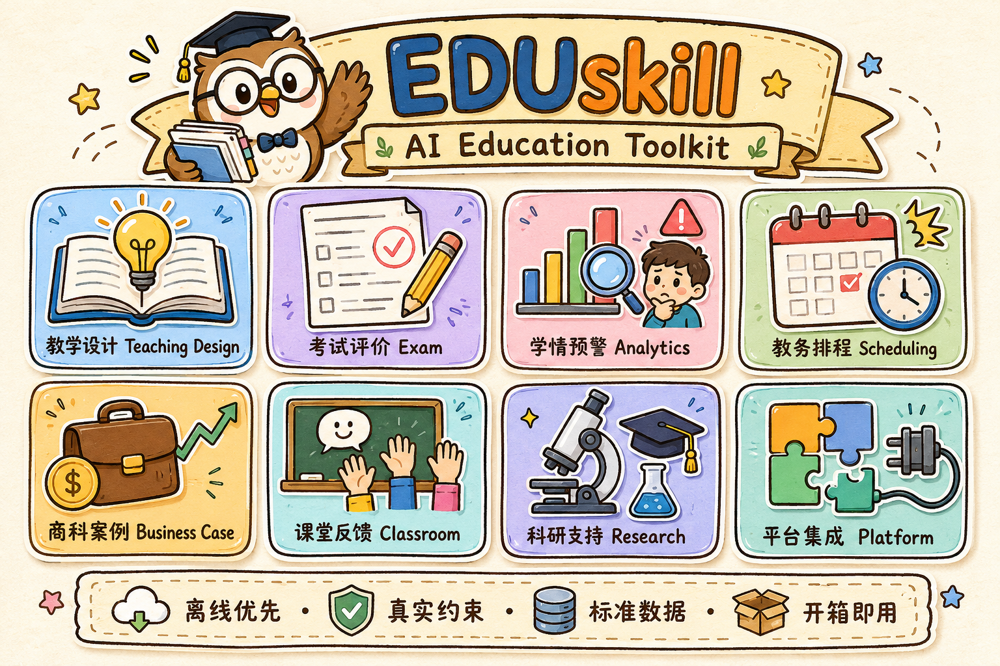

# EDUskill

> 一个正在生长的 AI 教育工具包集合，由一个人在碎片时间里每天做一点。

---

## 为什么做这些

我在思考一件事：**AI 真的能帮教育工作者减轻负担吗？**

教务秘书要手动排课、查冲突、核学分、组织实习分配；老师要设计教学目标、出卷、批改、做讲评——这些工作繁琐、重复、耗时，却很少有工具真正做到"开箱即用"。

于是我开始尝试：**把我每天的工作做成一个个教育领域的 Skill**，从真实的教学场景出发，能跑起来、有输出、可以实际用，而不是停留在 Demo 层面。

这个仓库就是这些尝试的归档。

---

## 重要说明

**这些工具目前处于早期阶段，不保证稳定性。**

- 有些场景覆盖不全，边界情况可能报错
- 有些输出格式还在迭代
- 有些逻辑经过自测，但未经过真实教学环境的大量验证

**非常欢迎你来试用、反馈、提建议。** 哪怕只是"这个功能没用"或者"我想要 XX 功能"，都很有价值。

---

## 整体架构



```
EDUskill
│
├── 教学设计与准备（Teaching Design & Prep）
│   ├── structured-teaching-plan-generator   结构化教学方案生成
│   ├── teaching-progress-planner            逐周教学进度日历编制
│   ├── edu-objective-assessment-checker     教学目标-评估一致性诊断
│   ├── classroom-activity-designer          课堂互动活动设计包
│   ├── lesson-runbook-builder               课堂授课运行单生成
│   ├── course-prep-readiness-auditor        备课就绪闭环审计
│   ├── course-material-accessibility-auditor 课程材料无障碍与可读性审核
│   └── talent-training-auditor              人才培养方案合规审核
│
├── 课堂与督导反馈（Classroom & Observation）
│   ├── classroom-interaction-diagnostic     课堂参与度证据化诊断
│   ├── lesson-observation-feedback          督导听课记录转行动建议
│   └── space-learning-mentor                Three.js 3D 空间学习导师
│
├── 考试与评价闭环（Exam & Assessment）
│   ├── exam-blueprint-generator             考试双向细目表
│   ├── exam-paper-assembler                 自动组卷与试卷预览
│   ├── exam-invigilator-planner             考场编排与监考日程
│   ├── exam-score-analyzer                  考后成绩与区分度诊断
│   ├── exam-review-planner                  讲评课备课规划与题卡
│   ├── exam-followup-reviewer               命题质量四象限复盘与回流
│   ├── assessment-moderation-auditor        成绩提交前审核与总评核验
│   └── exit-ticket-analyzer                 课后小测分层分析与补救分组
│
├── 学情、预警与支持（Student Analytics & Support）
│   ├── student-academic-warning             学业风险多维分级预警
│   ├── student-support-triage               学生咨询主题分流与答复
│   ├── attendance-followup-planner          缺勤跟进队列与沟通计划
│   ├── credit-progress-checker              培养方案学分毕业预检
│   ├── homework-grading-analyzer            作业批量批改与学情诊断
│   ├── assignment-load-balancer             作业截止日密集度与负荷平衡
│   ├── family-communication-rehearsal      家校沟通事实整理与预演
│   └── student-group-project-role-balancer  学生项目小组角色均衡分配
│
├── 教务排程与治理（Academic Scheduling & Governance）
│   ├── schedule-conflict-detective          排课冲突检测（教师×教室×班级）
│   ├── classroom-seating-planner            课堂座位编排与约束核验
│   ├── lab-reservation-scheduler            实验室预约防冲突排程
│   ├── internship-allocation-planner        学生企业实习志愿分配
│   ├── teaching-workload-calculator         教师教学工作量核算与超限校验
│   ├── teaching-quality-closure             教学质量整改闭环台账
│   ├── substitute-coverage-planner          教师缺勤代课与调课方案生成
│   └── course-section-consolidation-planner 教学班合并方案评估
│
├── 商科专业案例套件（Business Education Suite）
│   ├── business-teaching-case-generator     通用商科教学案例生成
│   ├── market-teaching-case-generator       市场营销教学案例
│   ├── finance-teaching-case-generator      财务管理教学案例
│   ├── hr-teaching-case-generator           人力资源管理教学案例
│   ├── operations-supplychain-teaching-generator  运营与供应链教学案例
│   └── public-administration-teaching-generator   公共管理教学案例
│
├── 科研与学术支持（Research Support）
│   ├── research-milestone-risk-radar        科研项目里程碑风险雷达
│   ├── lab-report-writer                    实验报告撰写助手
│   └── alterlab-scholar-eval                学术论文质量评估
│
├── 平台集成与通用工具（Integration & General Tools）
│   ├── canvas-week-plan                     Canvas LMS 周作业规划
│   └── 视频                                 HyperFrames 视频生成
│
└── 实验性 / 其他（Experimental / Other）
    ├── domain-analysis-execution            业务数据分析与进化算法执行
    └── evoflow-workflow-router              EvoFlow 工作流路由器
```

**考试评价链路已闭环**：`exam-blueprint-generator`（命题细目表）→ `exam-paper-assembler`（组卷）→ `exam-invigilator-planner`（考场监考）→ `exam-score-analyzer`（成绩分析）→ `exam-review-planner`（讲评备课）→ `exam-followup-reviewer`（命题回流）→ `assessment-moderation-auditor`（成绩提交前审核）。上游产物可直接作为下游输入，无需手工搬数据。

---

## 技能清单

> 每个技能都是一个独立目录，内含 `SKILL.md`（能力说明与触发条件）及配套脚本/模板。大多数技能**纯离线运行**，只读本地输入、生成可审核的预览产物，不会自动写回教务/LMS 系统，也不会自动发送通知。

### 教学设计与准备

| 技能包 | 功能 | 使用办法 |
|--------|------|----------|
| structured-teaching-plan-generator | 从课程大纲、课标、教材、人才培养方案生成可编辑、可追溯的结构化教学方案（三维目标、课时安排、知识图谱、教学大纲、课后习题） | 上传课程大纲/教材/讲义等材料，说明授课对象与课程性质；输出可编辑教学方案，覆盖基础教育/职业教育/高等教育 |
| teaching-progress-planner | 按校历把大纲章节自动编排为逐周教学进度表，并提示学时不匹配、容量溢出、提前结课 | 提供课程基本信息（总学时、周课时）、学期校历（起始日、教学周、考试周、节假日）与章节学时清单；输出 Markdown 周计划、JSON 与可导入 Excel 的 CSV |
| edu-objective-assessment-checker | 备课阶段对单元目标与测验/作业题做事前一致性体检（布鲁姆认知层级 + 逆向设计），发现"高目标低考核""目标无对应题"等问题 | 提供结构化 JSON（objectives + items/questions）；输出目标-题目覆盖矩阵与一致性诊断 |
| classroom-activity-designer | 根据课程主题、学生规模、课时与教学目标，生成可直接执行的小组活动、讨论、案例、练习或展示流程 | 说明主题/规模/课时/目标/课堂限制，或提供已有教案目标；输出时间轴、分工、教师提示语、学生产出与评价量规 |
| lesson-runbook-builder | 将教案、课程目标与活动转换为可直接执行的课堂授课运行单 | 提供教案/目标/活动信息；输出含时间轴、师生动作、形成性检查、差异化支持与异常预案的运行单 |
| course-prep-readiness-auditor | 检查课程或单节课备课材料是否具备目标、活动、评价、资源与差异化支持的可执行闭环 | 提供备课材料；输出分级缺口清单与补齐建议 |
| course-material-accessibility-auditor | 发布讲义/任务单/公告前，检查标题结构、链接文本、图片替代文本、表格说明、语言清晰度与敏感个人信息 | 提供讲义/公告/网页文本；输出可审核的无障碍与可读性整改预览（不自动修改或发布） |
| talent-training-auditor | 高校与职业院校人才培养方案政策合规审核，以及两版本差异对比 | 导入培养方案（Word/PDF/文本）并给出政策要求或选用内置框架；或同时导入两份方案；输出合规问题清单与定位修改建议 / 结构化差异报告 |

### 课堂与督导反馈

| 技能包 | 功能 | 使用办法 |
|--------|------|----------|
| classroom-interaction-diagnostic | 根据课堂互动记录诊断学生参与证据的覆盖、分层与缺口，生成下一节课的低风险干预建议 | 提供课堂互动记录或汇总数据；输出参与证据诊断与人工确认跟进预览 |
| lesson-observation-feedback | 将督导/教研员的课堂观察记录整理为证据化反馈、优先改进动作与下次听课核验点 | 提供听课观察记录；输出结构化反馈（离线运行，不替代人工评价、不写入教务系统） |
| space-learning-mentor | 面向数字艺术、设计、建筑、文化遗产等交叉学科，将课程目标转为可交互 Three.js 3D 学习任务，并用费曼四层诊断判断掌握程度 | 说明课程目标/学科方向；用于设计 3D/PBL 课程、诊断掌握度、辅导空间化创作、生成迁移实验 |

### 考试与评价闭环

| 技能包 | 功能 | 使用办法 |
|--------|------|----------|
| exam-blueprint-generator | 根据知识点权重、题型分值、难度目标生成考试双向细目表，并校验总分对齐、难度分布与认知层次覆盖 | 提供知识点及权重、题型与单题分值、难度目标；输出知识点×题型分值矩阵（细目表），作为组卷输入 |
| exam-paper-assembler | 按细目表与题库自动选题组卷，生成学生版/教师版试卷与组卷报告 | 提供细目表（或直接描述权重/分值/难度）与课程题库；输出 Markdown/JSON 试卷、缺口清单、难度分布与覆盖统计，并配 HTML 预览组件 |
| exam-invigilator-planner | 自动生成考场编排表与监考日程，明示考位/监考缺口 | 提供考试场次、考场容量与监考信息；触发词：考场、监考、排考、期末考安排 |
| exam-score-analyzer | 考后成绩智能分析：班级统计、分数段、每题得分率/区分度/整卷信度、知识点掌握度、预警名单、讲评建议 | 提供试卷元信息（题目→知识点·满分·题型·难度）+ 学生逐题得分 CSV；输出 Markdown/JSON/CSV 与自包含 HTML 可视化报告 |
| exam-review-planner | 按得分率把题目分为必讲/应讲/略讲，分配精讲时长，产出讲评课方案与分层辅导名单 | 复用 exam-score-analyzer 的 analysis.json 或提供逐题统计 CSV/JSON；输出讲评方案、A/B/C 分层名单、HTML 课件与 JSON/CSV |
| exam-followup-reviewer | 考后命题质量四象限复盘与回流：班级画像、共性薄弱点归因、命题改进建议、帮扶名单 | 输入 exam-score-analyzer 的 analysis.json（单班/多班）；输出复盘报告（MD/HTML）与可供下一轮命题的 blueprint_feedback.json |
| assessment-moderation-auditor | 成绩提交前审核多项成绩、权重与考勤，发现缺失、越界、总评异常与补救候选 | 提供多项成绩、权重与考勤数据；输出可复核审核报告（纯离线，不自动修改或提交成绩） |
| exit-ticket-analyzer | 分析课后小测/Exit Ticket 逐题作答，识别掌握分层、共性错误与下一课补救分组 | 提供逐题作答数据；输出可审核的形成性教学预览（不修改成绩、不发送通知） |

### 学情、预警与支持

| 技能包 | 功能 | 使用办法 |
|--------|------|----------|
| student-academic-warning | 多维度学情风险评分与分级预警，支持批量评估 | 提供学生学业数据；输出批量风险评分与分级预警结果 |
| student-support-triage | 将多条学生咨询按主题、紧急度与责任角色分流，生成回复草稿与转交预览 | 提供学生咨询内容；输出分流结果与可审核答复草稿（不发送消息、不写工单） |
| attendance-followup-planner | 从一段时间考勤记录识别重复/连续缺勤与需优先核实的学生，生成分级跟进队列 | 提供学生考勤记录；输出分级跟进队列、沟通预览与班级汇总（不自动联系学生、不写回系统） |
| credit-progress-checker | 对照培养方案逐门核对学分缺口，生成毕业预检报告 | 提供学生/全班成绩单与培养方案；输出必修未过/缺修、选修与任选学分缺口的学分对账报告 |
| homework-grading-analyzer | 批量批改客观题+半结构化主观题，自动产出班级学情诊断（知识点掌握度、共性错题、分层干预） | 提供答案 JSON（answer_key）与学生作答 CSV；输出学情分析报告与可导出的成绩 Excel/CSV |
| assignment-load-balancer | 检测同一班级作业截止日是否过于集中、预计学习时长是否超周负荷，给出可解释的延期建议 | 提供班级作业清单与截止日/预计时长；输出密集度与周负荷诊断及延期建议 |
| family-communication-rehearsal | 将匿名化学生表现事实整理为家校沟通议程、事实陈述、开放式问题、支持建议与行动项 | 提供匿名化学生表现事实；输出可审核沟通预览（只生成预览，不发送、不作诊断或纪律判断） |
| student-group-project-role-balancer | 按能力、角色偏好、人数与角色覆盖要求生成小组角色分配，识别技能缺口与负担不均 | 提供学生能力/偏好与项目要求；输出可解释的小组分工预览（不修改学籍或成绩） |

### 教务排程与治理

| 技能包 | 功能 | 使用办法 |
|--------|------|----------|
| schedule-conflict-detective | 学期初排课冲突检测，三维核查教师×教室×班级资源占用并给出调课建议 | 输入排课 JSON；输出冲突清单与可执行调课建议 |
| classroom-seating-planner | 按分离/前排/禁用座位约束生成可解释的课堂座位表与冲突清单 | 提供教室座位、学生名单与座位约束；输出座位表与人工确认预览（不写回系统） |
| lab-reservation-scheduler | 实验室预约无冲突排程，明示缺口与资源利用率 | 提供实验室资源与预约申请（课程/班级/人数/教师/日期/时段/资源要求）；触发词：实验室预约、实验排程、机房预约 |
| internship-allocation-planner | 按学生志愿与企业容量生成无冲突的"学生→实习单位×期次"分配方案 | 提供学生名单、志愿与企业容量；输出分配方案、缺口与冲突原因及单位×期次利用率 |
| teaching-workload-calculator | 按课程类型、人数档、合班数、新开课与指导任务折算教师学期工作量，判定超限/偏高/正常/不足 | 提供课程与任务数据；输出可复核折算明细与数据问题清单（不写回系统、不触发绩效） |
| teaching-quality-closure | 将督导、评教、问卷或教学检查发现转为分级整改台账 | 提供检查/评价发现；输出含责任角色、动作、目标日期与复核证据的整改台账预览 |
| substitute-coverage-planner | 教师临时缺勤时，按课表、代课资质与忙闲、教室容量与日负荷生成代课/调课候选 | 提供课表、代课教师信息与约束；输出可解释候选方案与冲突清单（纯离线预览） |
| course-section-consolidation-planner | 教学班合并方案评估：低选课人数/师资调整/教室变化时比较合班候选 | 提供班级、容量、课表、进度、授课语言、校区与教师负荷信息；输出容量/冲突/兼容性检查与可审核方案预览（不自动合班、不写回 SIS） |

### 商科专业案例套件

> 六个方向共用同一套"可编辑、可追溯"的生成逻辑：上传课程标准/教材/案例/数据/政策材料，要求生成课程目标、案例教学、课堂活动、数据任务、评价产物或教学计划。

| 技能包 | 功能 | 使用办法 |
|--------|------|----------|
| business-teaching-case-generator | 通用商科教学与案例分析方案（市场、战略、财务、管理学、组织行为、人力、运营、商业模式、创业、数字化经营等） | 上传商科课程标准/教材/案例/年报/行业报告/经营数据/访谈材料；输出教学目标、课时、案例、活动、数据任务、知识图谱、大纲与习题 |
| market-teaching-case-generator | 市场营销方向教学与案例分析方案 | 提供市场营销课程标准/教材/案例/数据/政策材料；输出课程目标、案例教学、活动、数据任务、评价产物或教学计划 |
| finance-teaching-case-generator | 财务管理方向教学与案例分析方案 | 提供财务管理课程标准/教材/案例/数据/政策材料；输出同上结构的方案 |
| hr-teaching-case-generator | 人力资源管理方向教学与案例分析方案 | 提供人力资源管理课程标准/教材/案例/数据/政策材料；输出同上结构的方案 |
| operations-supplychain-teaching-generator | 运营与供应链管理方向教学与案例分析方案 | 提供运营与供应链课程标准/教材/案例/数据/政策材料；输出同上结构的方案 |
| public-administration-teaching-generator | 公共管理方向教学与案例分析方案 | 提供公共管理课程标准/教材/案例/数据/政策材料；输出同上结构的方案 |

### 科研与学术支持

| 技能包 | 功能 | 使用办法 |
|--------|------|----------|
| research-milestone-risk-radar | 依据项目节点、进展、依赖与截止日期识别逾期/临近/阻塞风险，生成可确认行动清单 | 提供项目节点与进展的本地 JSON；输出风险雷达与行动清单（离线分析，不写回外部系统） |
| lab-report-writer | 跨学科撰写、编辑、润色、结构化实验报告与课程实验报告 | 提供模板/原始数据/图片/笔记，或仅给出简要需求；输出 DOCX 或 Markdown 交付物 |
| alterlab-scholar-eval | 用 ScholarEval 框架从问题定义、方法、分析、写作等维度对学术成果打分并给出可执行反馈 | 提供论文/学位论文/研究成果；输出量化量规评分与结构化评估，适合评分或跨修订版对比发表就绪度 |

### 平台集成与通用工具

| 技能包 | 功能 | 使用办法 |
|--------|------|----------|
| canvas-week-plan | Canvas LMS 学生周作业规划：汇总各课程截止日、提交状态、成绩与同伴互评 | 学生说"这周有什么要交""帮我规划这周""每周检查"即可触发，整理一周课业 |
| 视频 | HyperFrames 视频项目生成器：基于 HTML+CSS+GSAP 把文章/文案转为含配音、字幕与动画的视频，一键渲染 MP4 | 提供文章/文案；触发词：HyperFrames、HTML 视频、文章转视频、口播视频。适用于内容视频化、批量短视频 |

### 实验性 / 其他

> 以下两个技能偏向通用数据分析与算法执行，非教育主题，暂作为实验性工具保留。

| 技能包 | 功能 | 使用办法 |
|--------|------|----------|
| domain-analysis-execution | 面向复杂业务场景的经营监控、异常诊断、归因、趋势预测、分层、漏斗、影响模拟与 A/B 实验分析，并集成 EvoFlow 进化算法优化能力 | 提出业务指标变化/原因分析/预测/优化需求并提供业务数据；按关键词路由到实验管理、可视化、通用优化或领域业务分析工作流，输出带证据校验的结论 |
| evoflow-workflow-router | EvoFlow 全链路工作流路由器，整合进化算法实验管理、结果可视化与数据分析，按任务自动路由到最匹配工作流 | 描述任务（或显式指定工作流）；触发词：EvoFlow、进化算法、优化问题、路径规划可视化、数据分析报告、提交实验 |

---

## 参与测试与反馈

如果你是老师、教务人员、教研员，或者只是对这件事感兴趣：

- **试用**：挑一个你熟悉的场景，用你真实的数据跑一下
- **反馈**：有 bug、有不合理的地方、有想要的功能，直接开 Issue
- **交流**：欢迎在 Discussions 里聊教育 AI 工具的实际落地体验

不需要会写代码，会用就行。

---

## 作者

ht · 每天做一点，慢慢积累。
